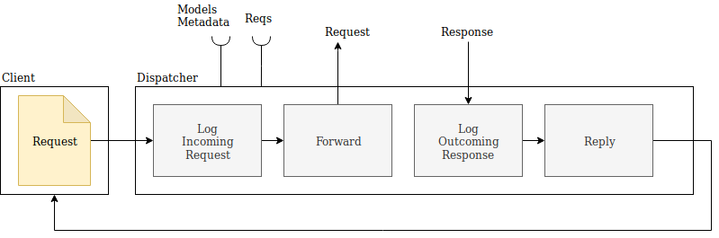
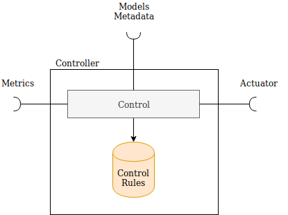
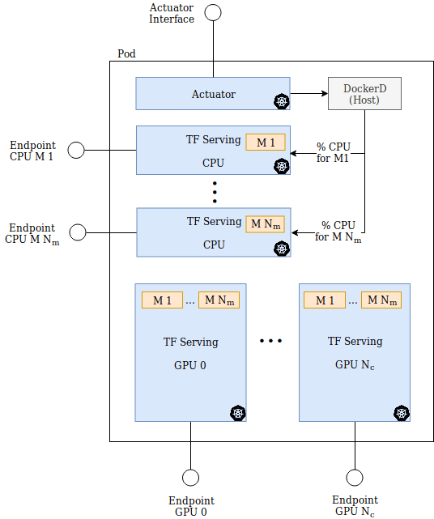
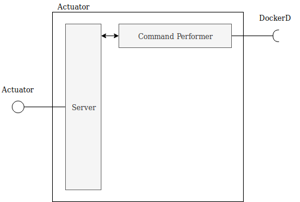

# Architecture Details


## Controller / Dispatcher
### Brief description
This component takes as input requests, dispatches them to devices, produces metrics and controls nodes

### Description
#### Dispatcher
This component dispatches the incoming request to a selected device.



In particular, the dispatcher for every request:

1. adds an entry to the reqs table:
    + it generates an ID for the incoming request and associates the request to the client
    + it records the timestamp for the incoming request
2. selects the device where to forward the request using the models metadata and forwards the request to that device
3. when a response is produced, it updates the response timestamp
4. forwards the response to the client

##### Dispatching policy
Where does the request will be processed?
It reads the models metadata to find out which devices are available and where the request can be forwarded.
The request will be forwarded to the device i with probability P_i.

Sum P_i = 1

The dispatcher should use only devices with quotas > 0 for that model.

#### Controller
This component controls the nodes, using the control rules and the available metrics, through the actuator interfaces.

Every node exposes an actuator interface.



The controllers can:

- update the CPU resources given to a model on a node
- update the # of GPU available for a model

It uses the metrics extracted from the data produced by the dispatcher (e.g. processing time) to take decisions i.e. increase / decrease the CPU quota for a model inside a pod, or increase / decrease the available GPUs for a model.

### Interfaces
#### Required
The dispatcher / controller requires:

- actuator interfaces: to control the containers in the pods
- requests: to store the information about the requests
- models metadata: to store the information associated with models
- metrics: they are computed from the reqs store
    + avg, min, max response time per model
    + total number of reqs in the queue (reqs that are waiting to be processed + reqs that are currently processed)
    + number of reqs in the queue per model

### Example of reqs store
The reqs store contains all the information about the incoming request and outcoming responses

| ID  | Model | Data | Client   | TS In  | TS Out |
| --- | ------| -----| -------- | ------ | ------ |
| 123 | M1    | ...  | Client 1 | 100    | 200    |
| 324 | M1    | ...  | Client 2 | 101    |        |
| 245 | M2    | ...  | Client 2 | 130    | 135    |
| 155 | M3    | ...  | Client 3 | 160    | 210    |

- ID: req identifier
- model: the model id
- data: the data of the request
- client: the id of the client
- TS In: timestamp of the incoming request
- TS Out: timestamp of the outcoming response, empty if waiting for the response

### Example of models metadata store
The models metadata store contains all the information about the TF serving instances

| Model | Device type | Node | Endpoint   | Port | Quota |
| ------| ------------| ---- | ---------- | ---- | ----- |
| M1    | CPU         | n1   | n1/m1      | 5000 | 50%   |
| M2    | CPU         | n1   | n1/m2      | 5001 | 50%   |
| M1    | GPU         | n1   | n1/m1      | 5002 | 100%  |
| M2    | GPU         | n1   | n1/m2      | 5002 | 0%    |
| M1    | CPU         | n2   | n2/m1      | 5000 | 70%   |
| M2    | CPU         | n2   | n2/m2      | 5001 | 30%   |

- model: the model id
- device type: CPU or GPU
- node: the node id
- endpoint: the node where to find the model
- port: the port where to send the request
- quota: the % of the device assigned to the model
    + 0%: the device is disable
    + GPU is always 0 or 100%

### Improvements
- resubmit the request if timeout
- reqs cache: save the response of a request to avoid recomputing

## Pod
### Brief description
The pod contains all the containers running TF serving and the container for the actuator.



Where N_m is the number of models

### Description
In every pod are deployed:

- an actuator inside a container
- a TF serving container for each model for the CPU
- a TF serving container for each GPU serving all the models

Given N_m the number of served models and N_g the number of GPUs, the total number of containers for each node is: N_containers =  N_m + N_g

Each TF serving container exposes an RESTful API and gRPC.

#### Actuator
It exposes an interface to perform commands on the machine. 



- The CPU % for each model is set with a docker command by the actuator in the Pod using Docker out of Docker.

## Container initialization
// TODO: are the given models fixed or they could change at runtime?

- static models
- dynamic models

### Static models
1. Produce a K8s deployment, given a config file with the same information in Models Metadata:
    - nodes
    - devices
    - models
    - [quotas]
```
{
    "nodes": [
        {
            "id": "n1",
            "devices": ["CPU", "GPU", "GPU"],
            "models": ["m1", "m2"]
            "quotas": [0.5, 0.5, 1, 0, 0, 1]
            // give 50% to m1 CPU, 50% to m2 CPU
            // give GPU0 to m1 and GPU1 to m2
        }
    ]
}
```
2. populate Models Metadata 

### Dynamic models
Starting with an empty Models Metadata:

- every time a new model is added:
    + add a new CPU container associated to the model with the given quota if available
    + updates the models available on GPUs with TF serving API
- every time a new model is removed:
    + remove the CPU container associated to the model and release the quota
    + updates the models available on GPUs with TF serving API