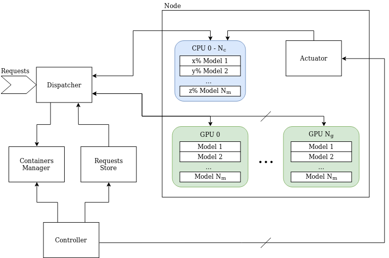

# Architecture Details

## Components
> Run setup.sh to initialize all the environments of the components
 
### Dispatcher
This component takes as input requests and dispatches them to devices.

[More](./components/dispatcher/)

### Containers Manager
This component manages containers and models and all their relative information.

[More](./components/containers_manager/)

### Requests Store
This component takes care of requests. It is responsible for storing the information about the requests.

[More](./components/requests_store/)

### Controller
(not implemented yet)

This component interacts with the actuator to control nodes.

[More](./components/controller/)

### Actuator
This component is used to control the resources of nodes.

[More](components/actuator_controller/)

### Dashboard
This component is used to show a dashboard where information about the system can be retrieved.

[More](./components/dashboard/)

### Benchmark
This component is used to benchmark the system and to profile models.

[More](components/benchmark/)

## Deployments
K8s files to deploy the system.

[More](./deployments/)

## Models
The models served by the system.

[More](./models/)

## Testing
Test the system

[More](./testing/)

## Simulations
Simulate the system with different queue policies

[More](./simulations/)