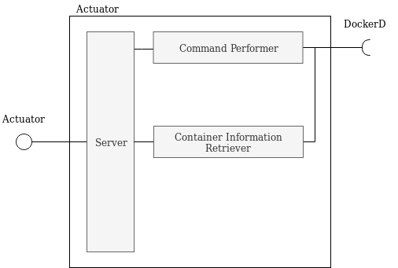

# Actuator
This component is used to control the resources of nodes.



This component runs on every node. It uses the dockerd of the node to

- retrieve information about containers
- set limits on container's resources (cpu_quota)

## Required interfaces
- DockerD

## Run
### Init
```
virtualenv env
source env/bin/activate
pip install -r requirements.txt
```
### Start
```
python main.py
```

## Endpoints
See "rest-client.rest" for examples 

DEFAULT PORT: 30000

##### GET /
Get the status of the component

##### GET /containers
Get the list of running containers

##### POST /containers/<string:container_id>
Set limits on container's resources


#### Required modules 
- Docker for Python https://docker-py.readthedocs.io/en/stable/


