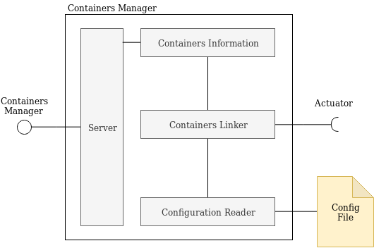

# Containers Manager
This component controls the nodes, using the control rules and the available metrics, through the actuators interfaces.



This component:

- reads containers list from a configuration files
- communicates with the actuators on each node to get the containers ids
- exposes endpoints to retrieve information about models and containers

## Required interfaces
The controller requires:

- *Actuator*: to get informations about the containers in the pods


### Example of containers and models
[More information here](../common/)


## Container initialization
- static models

### Static models
1. Read the *config* file with information about models and containers
2. Start a K8s deployment with the same information in the *config* file


## Run
### Init
```
virtualenv env
source env/bin/activate
pip install -r requirements.txt
```
### Start
```
python main.py
```

## Endpoints
See "rest-client.rest" for examples 

DEFAULT PORT: 5001

##### GET /
Get the status of the component

##### GET /models
Get the loaded models

##### GET /models/<node>
Get the loaded models on the given node

##### GET /containers
Get the loaded containers

##### GET /containers/<node>
Get the loaded containers on the given node

##### (draft) POST /models
Add a new model

##### (draft) POST /containers
Add a new container


