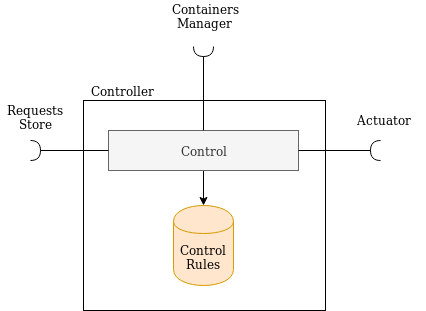

# Controller
(not implemented yet)

This component controls the nodes, using the control rules and the available metrics, through the actuators interfaces.



Every node exposes an actuator interface and the controllers can:

- update the CPU resources given to a model on a node

It uses the metrics provided by the *Requests Store* (e.g. processing time) to take decisions i.e. increase / decrease the CPU quota for a model inside a pod, or increase / decrease the available GPUs for a model.

## Required interfaces
The controller requires:

- *Actuator*: to control the containers in the pods
- *Requests Store*: to store the information about the requests
- *Containers Manager*: to get information about models and containers

## Run
### Init
```
virtualenv env
source env/bin/activate
pip install -r requirements.txt
```
### Start
```
python main.py
```

## Endpoints
See "rest-client.rest" for examples 

DEFAULT PORT:

##### GET /
Get the status of the component


