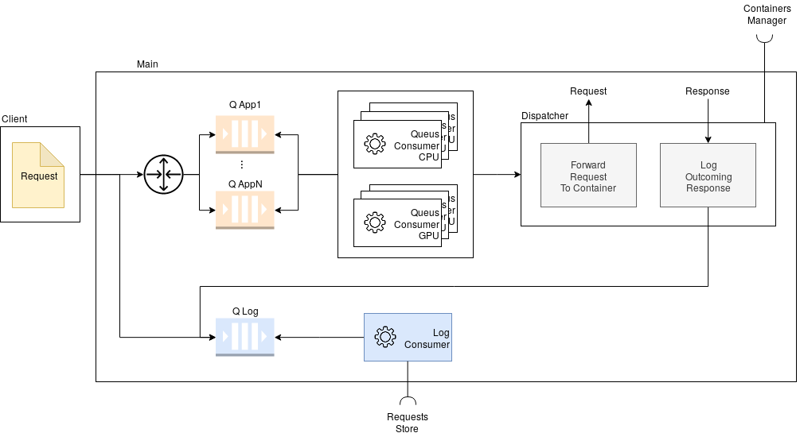

# Dispatcher
This component takes as input requests and dispatches them to devices.



The dispatcher initializes the information about the models and containers using the services provided by the
*Containers Manager*. Furthermore, it sends logged requests to the *Requests Store*.

In particular, for every request the dispatcher:

1. logs the incoming request, adding the request to the log queue (the request is in the *created* state)
2. adds the request to the application queue
3. consumers select the device where forward the request using a dispatching policy
4. consumers forwards the request to that device (the request is in the *waiting* state) using the dispatcher component
5. when a response is received, consumers add the request to the log queue (in the *completed* state)
6. the log queue in processed and sent to the request store

A thread is started at the beginning to consume the log queue that have to be sent to the *Requests Store*.
A pool of threads is started at the beginning to consume the applications queues.

## Dispatching policy
### Internal Dispatching Policy
It describes how the request is forwarded to the containers.
The dispatcher reads the models metadata to find out which devices are available and where the request can be forwarded.

Policies:

1. Round Robin: forwards the request to the next container
2. Random: forwards the request to a random container

### Queues Policy
it describes how the requests are taken from the applications queues.

Policies:

1. Random: select a request from a random queue
2. Round Robin: select a request from a queue with the round robin policy
3. Longest Queue: select a request from the application with the longest queue
4. Heuristic 1

## Run
### Init
```
virtualenv env
source env/bin/activate
pip install -r requirements.txt
```
### Start
```
gunicorn -w <num_of_workers> "main:create_app(containers_manager="<containers_manager_host>", requests_store="<requests_store_host>",
verbose=1)"
```

Arguments:

- number of workers
- containers manager host
- requests store host
- verbose

## Required interfaces
The dispatcher requires:

- *Requests Store*: to store the information about the requests
- *Containers Manage*: to get information about models and containers

## Endpoints
See "rest-client.rest" for examples 

DEFAULT PORT (gunicorn): 8000

##### GET /
Get the status of the component

##### POST /predict
Send a new request

#### Improvements
- resubmit the request if timeout
- reqs cache: save the response of a request to avoid recomputing