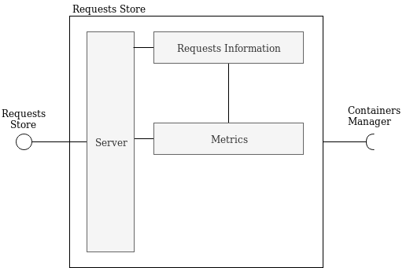

# Requests Store

This component takes care of requests. It is responsible for storing the information about the requests.



This component:

- saves information about requests (in-memory)
- produces metrics

## Required interfaces
The controller requires:

- *Containers Manager*: to get information about models


### Example of requests
[More information here](../common/README.md)


## Run
### Init
```
virtualenv env
source env/bin/activate
pip install -r requirements.txt
```
### Start
```
python main.py --containers_manager <containers_manager_host>
```

## Endpoints
See "rest-client.rest" for examples 

DEFAULT PORT: 5001

##### GET /
Get the status of the component

##### GET /requests
Get the requests

##### GET /metrics/model
Get the metrics grouped by model

##### GET /metrics/container
Get the metrics grouped by container

##### POST /requests
Post a request

##### DELETE /request
Delete the requests