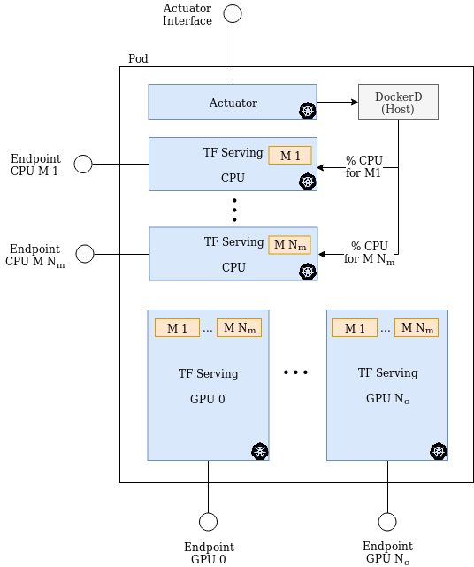

# Deployment
## Pod
The pod contains all the containers running TF serving and the container for the actuator.



Where N_m is the number of models

### Description
In every pod are deployed:

- an actuator inside a container
- a TF serving container for each model for the CPU
- a TF serving container for each GPU serving all the models

Given N_m the number of served models and N_g the number of GPUs, the total number of containers for each node is: N_containers =  N_m + N_g

Each TF serving container exposes a RESTful API.

## K8s
K8s files to deploy the system:

- deployment-tfcontrolled: this configuration file deploys the containers for the CPU and GPUs and the actuator. Two volumes are mounted:
    + shared-models: the host shares the served model with the container
    + docker-sock: to allow the actuator to control Docker of the host

- service-tfcontrolled: it is used to expose the endpoints of the containers


## Local deployment
### Minikube
- https://kubernetes.io/docs/tasks/tools/install-minikube/


```
minikube start
```


- Build the actuator image with Docker of minikube so that
it is visible to K8s  
```
eval $(minikube docker-env)
cd components/actuator/    
docker build -t tfcontrolled-actuator:local .
```


- Create the K8s deployment and service
```
kubectl create -f deployment-tfcontrolled.yml
kubectl create -f service-tfcontrolled.yml
kubectl get po,no,deploy,svc
```

#### Launch
1. the *Containers Manager*. [More](../components/containers_manager/)
2. the *Requests Store*. [More](../components/requests_store/)
3. the *Dispatcher*. [More](../components/dispatcher/)


#### Test
[More](../testing/)

## Remote deployment
- install [nvidia drivers](https://docs.nvidia.com/cuda/cuda-installation-guide-linux/index.html#ubuntu-installation)
- install [Docker and K8s](https://www.linode.com/docs/applications/containers/kubernetes/getting-started-with-kubernetes/)
- install [nvidia-docker2.0](https://github.com/NVIDIA/nvidia-docker/wiki/Installation-(version-2.0))
- install the [K8s device plugin](https://github.com/NVIDIA/k8s-device-plugin)

### Repository
```
git clone git@github.com:NicholasRasi/tfcontrolled.git
```
### Models
Download models
```
wget https://mega.nz/linux/MEGAsync/xUbuntu_18.04/amd64/megacmd-xUbuntu_18.04_amd64.deb
sudo dpkg -i megacmd-xUbuntu_18.04_amd64.deb
sudo apt-get install -y -f
mkdir models
mega-get 'https://mega.nz/#F!tclUQCIA!Qh8dh4SoxDAlGgF-05aHBA' .
```

Install pip3 and virtualenv
```
sudo apt-get install python3-pip
sudo pip3 install virtualenv 
```

Setup virtualenvs
```
chmod 777 ./setup.sh
./setup.sh
```

### Steps
1. edit ```deployments/remote/deployment-tfcontrolled.yml```
2. edit ```deployments/remote/service-tfcontrolled.yml```
3. edit ```models/models_remote.config```
4. edit ```containers_manager/config_remote.yml```
